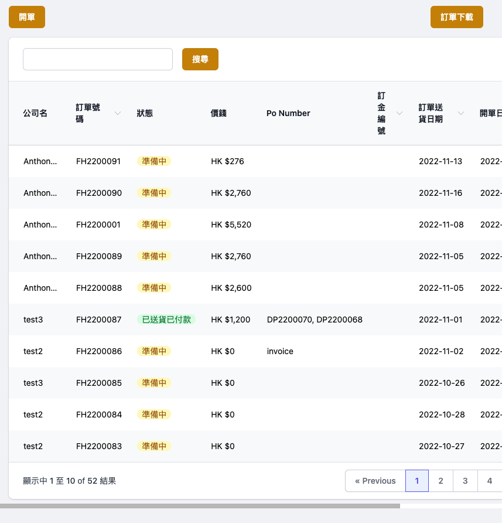
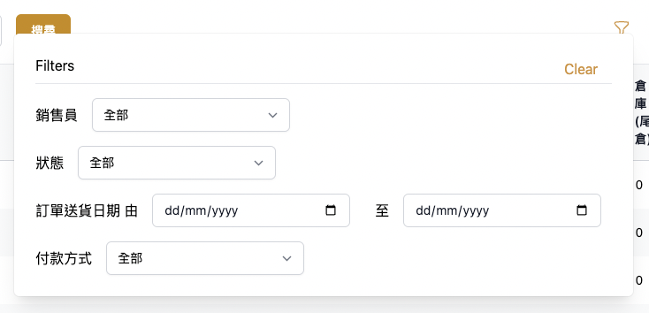
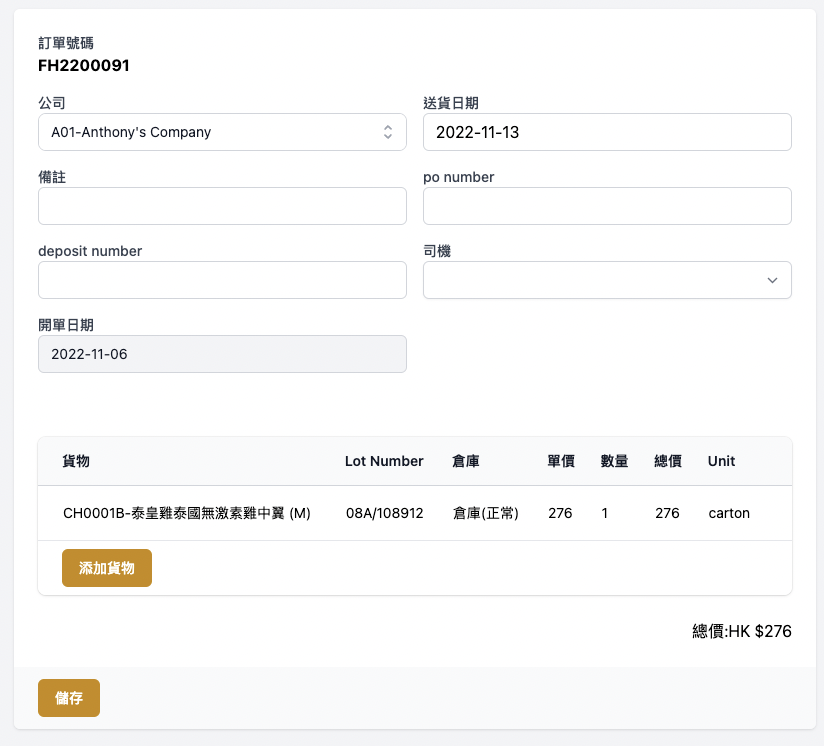
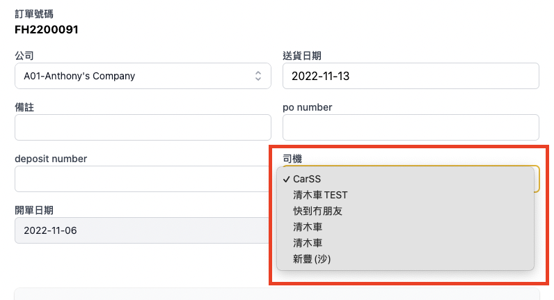
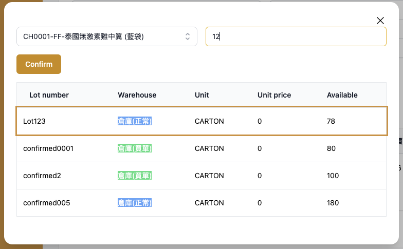
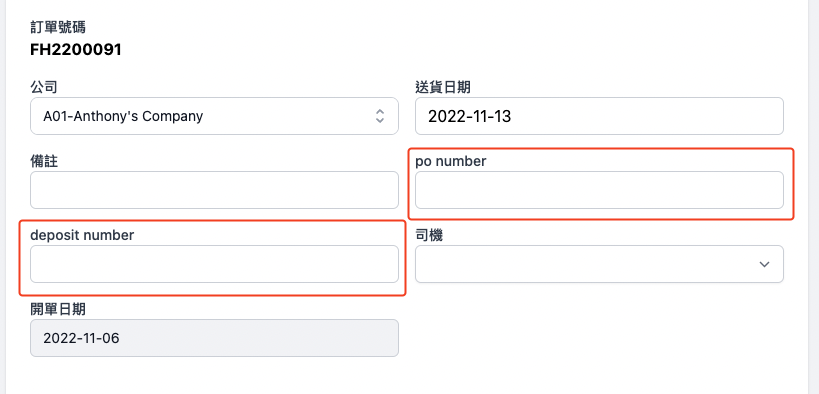
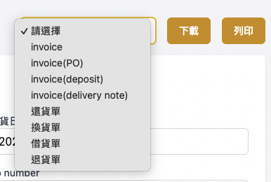
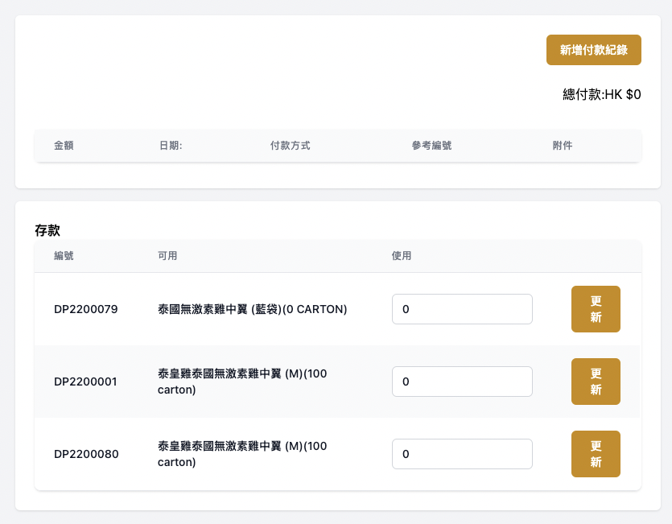
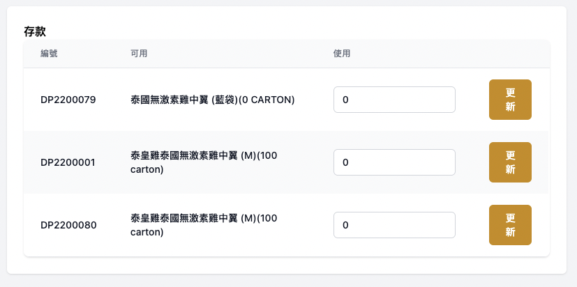

# [Fortune House User Guide](https://anthonyxcode.github.io/fortune-house-user-guide/)

# 目錄
- [Fortune House User Guide](#fortune-house-user-guide)
- [目錄](#目錄)
- [設定](#設定)
- [用戶](#用戶)
- [產品](#產品)
- [客戶](#客戶)
- [客戶訂金](#客戶訂金)
- [訂單](#訂單)
- [司機](#司機)
- [庫存](#庫存)
- [送貨](#送貨)
# 設定

用戶更改系統語言及登出系統

用戶更改頁面

# 用戶

admin用戶可新增其他用戶以登入系統

如登入的用戶有編辜帳戶權限，便可更改其他用戶資料，包括密碼

# 產品

用戶可在產品頁查看所以產品

用戶可以下載所有產品，更新後可重新導入，**但格式必須相同**

用戶可更改產品資料

用戶可查看出入倉資料

# 客戶

用戶可下載所有客戶，並生成Excel表格
更新Excel表格後可重新導入資料, **但格式必須相同**

用戶可修改客戶資料

用戶可以為每個客戶定義產品價格，如沒有定義價格，開單時系統將會使用預設價格.

# 客戶訂金

客戶可預購產品，預購後需在`新增訂金`部份加入項目

加入訂金後，可在`訂金`部份查看該項目

按下訂金行可查看詳情

訂金詳情頁可下載不同報表

**如訂金還未使用**，可刪除該訂金

# 訂單

建議訂單處理流程
1. 新增訂單 (填單訂單內容，包括選擇客人、司機、送貨日期及產品)
2. 發出Invoice
3. 確定收款後，輸入收款詳情(例如: 使用現金或轉帳、使用訂金購貨)
4. 更新訂單狀態

用戶可在訂單頁面查看訂單

亦可利用篩選工具，收窄訂單範圍

填寫資料新增訂單

選擇送貨司機，司機名單可在司機頁新增或更改

輸入產品，**必須揀選產品，lot和數量**

輸入 PO 或 deposit number，**輸入後並不會自動扣除deposit數量，只會在invoice上出現**

下載或列印invoice

確認已送貨及收到款項後，輸入付款資料

若現金或轉帳付款，可在付款部分輸入及更改

若以訂金收取款項，可在訂金部分輸入及更改

最後更改訂單狀態

# 司機

司機頁面可查看司機列表

用戶可下載司機列表，生成Excel檔

用戶可更改司機資料，**車隊名**會在開單或選取欄內顯示

# 庫存

用戶可查看所有庫存變動

用戶可下載表格作統計之用 

用戶可查看或更改入倉貨品的資料

用戶可查看該Lot貨品之出貨紀錄

# 送貨

用戶可查看送貨資料

當選取適當篩選後後，便可生成**貨倉處理單**及**送貨表**

